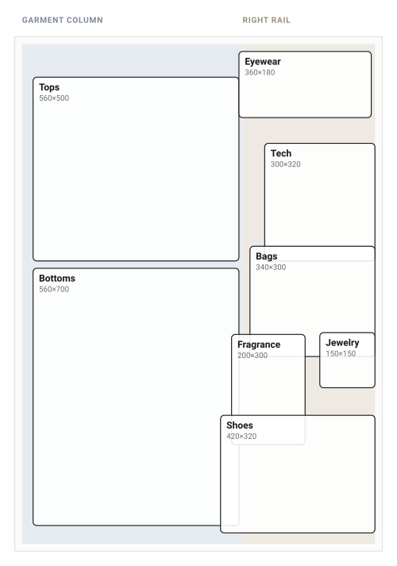

<div align="center">

# flatly

**Keep your clothes as cut-out PNGs, then style them into flat lay outfit boards — entirely in your browser.**

[](https://nextjs.org)
[](https://www.typescriptlang.org)
[](https://tailwindcss.com)
[](https://ui.shadcn.com)
[](#where-your-data-lives)

<!-- TODO: drop a studio screenshot at docs/studio.png and uncomment this line -->
<!--  -->



</div>

## Contents

- [Why](#why)
- [Quick start](#quick-start)
- [The four tabs](#the-four-tabs)
- [Backgrounds](#backgrounds)
- [Inspiration](#inspiration)
- [How auto-placement works](#how-auto-placement-works)
- [Shortcuts](#shortcuts)
- [Where your data lives](#where-your-data-lives)
- [Project structure](#project-structure)
- [Not built yet](#not-built-yet)
- [License](#license)

## Why

Outfit flat lays get rebuilt by hand every time — cut out the pieces, drag them around a canvas
until the spacing looks right, start over tomorrow. flatly keeps the pieces so you only cut them out
once, and does the arranging for you: every piece has a category, every category owns a spot on the
board, and a double click puts it there.

## Quick start

```bash
npm install
npm run dev
```

Open <http://localhost:3000>. There is no setup, no `.env`, no account — the first thing to do is
drop some images into the Wardrobe tab.

Transparent cut-out PNGs look best — and if you have not got one, flatly will usually make one for
you. See [Backgrounds](#backgrounds).

## The four tabs

**Wardrobe** — your pieces. Add them by dropping image files anywhere on the panel, by clicking
*Add pieces* (upload one or many), or by pasting an image URL. Linked images are downloaded and
stored locally when the host allows it; if it refuses, the piece is hotlinked instead and marked
with a broken-link badge — it will then need the internet, and can block PNG export. Each piece gets
a category, guessed from the file name and editable at any time.

**Studio** — the board, a fixed 1000 × 1400 artboard that scales to fit the window.

- **Double-click** a piece in the palette and it drops into the slot its category owns.
- **Drag** a piece from the palette onto the board to place it exactly where you drop it.
- On the board: drag to move, corner handle to resize, the handle above a piece to rotate
  (<kbd>Shift</kbd> snaps to 15°). <kbd>Shift</kbd> while moving locks to one axis, and pieces snap
  to the board's center lines.
- **Navigate** as in Photoshop: a mouse wheel zooms about the pointer, a trackpad swipe pans and
  a pinch zooms; middle-drag or hold <kbd>Space</kbd> to pan; <kbd>Shift</kbd>+<kbd>1</kbd> fits
  and <kbd>Shift</kbd>+<kbd>0</kbd> is 100%.
- *Auto-arrange* re-flows everything into the template, anchors first.
- *Save* stores the outfit; *PNG* exports the board at 2× (2000 × 2800).

**Inspiration** — a board of other people's flat lays to work from. See [Inspiration](#inspiration).

**Outfits** — saved layouts with rendered previews. Open one back in the studio, duplicate it,
export it, or delete it.

## Backgrounds

A product shot on a white sweep is not a cut-out, so flatly makes one on import: it reads the border
of the image, and if the edge is a single flat colour it floods inwards from all four sides, clears
what it reaches, and crops away the empty margin. Interior whites — a label, a pale stripe — survive,
because they are not connected to the edge. Enclosed pockets, like the gap between two trouser legs,
are cleared too.

It runs on a canvas in your browser. No model download, no upload, no API key, and it works offline.

It also knows when to keep its hands off, and leaves the image untouched if:

- the image already has transparency;
- the border is not one consistent colour (a photo taken on your carpet);
- the result would come out shredded — a **pale garment on a pale backdrop** is the case it cannot
  do, because the garment and the floor are the same colour to a flood fill.

The original upload is always kept, so *Remove background* and *Restore original* in a piece's menu
are both one click, and the toggle in the add dialog turns the whole thing off.

For a photo of a garment on a person, this is the wrong tool — that needs a generative model, which
does not run in a browser. Lay the piece flat, shoot it against a plain wall or duvet, and this will
cut it out.

## Inspiration

Somewhere to keep the flat lays you are working from, and a way to build against them.

**Collect.** Drag a pin straight out of a Pinterest tab and drop it here — a drag between tabs
carries a URL rather than a file, which is handled — or paste an image or image URL with
<kbd>Ctrl/⌘</kbd>+<kbd>V</kbd>, or upload from disk. Images are fetched and stored on your device
where the host allows it, and hotlinked when it does not. References are kept whole: no cut-out,
no trimming, because they are somebody else's photograph rather than a piece of your wardrobe.

**Trace.** *Trace* on any reference pins it behind the board in the studio at adjustable opacity,
so you can match a layout you like rather than eyeball it. The inspector has the opacity slider.
It is a guide only — it is never saved with the outfit and never appears in an export.

**Browse.** Pinterest has no public search API — the v5 API covers your own boards and ads, behind
app review — so searching from inside the app is not something this can do honestly. Instead there
are shortcuts out to Pinterest searches, and a slot for a public board URL that renders through
[Pinterest's own embed widget](https://developers.pinterest.com/docs/web-features/widgets/), which
serves the pins from their CDN and links back to them.

## How auto-placement works

The board is zoned. Garments own the wide left column, small goods own the right rail, and each
category has an ordered list of slots inside its own zone — the diagram above shows each category's
first choice, drawn from the real numbers in [`src/lib/layout.ts`](src/lib/layout.ts).

Placing a piece walks that list and takes the first slot that is free, where "free" means no
meaningful overlap with what is already down — cut-outs carry a lot of transparent padding, so boxes
that merely touch are fine. If every slot is taken it sweeps for a gap, working outwards from the
category's preferred spot and staying inside its zone.

Zoning is what makes the result independent of the order you add things in: a ring dropped first
cannot squat the spot the shirt wants. Adding eight pieces accessories-first and garments-first
produces the same board.

## Shortcuts

| Key | Action |
| --- | --- |
| <kbd>Ctrl/⌘</kbd>+<kbd>Z</kbd> / <kbd>Ctrl/⌘</kbd>+<kbd>Shift</kbd>+<kbd>Z</kbd> | Undo / redo |
| <kbd>Ctrl/⌘</kbd>+<kbd>S</kbd> | Save outfit |
| <kbd>Ctrl/⌘</kbd>+<kbd>D</kbd> | Duplicate selection |
| <kbd>Delete</kbd> | Remove from board |
| Arrow keys | Nudge (<kbd>Shift</kbd> for 10 units) |
| <kbd>[</kbd> / <kbd>]</kbd> | Send back / bring forward (<kbd>Shift</kbd> for all the way) |
| <kbd>Esc</kbd> | Deselect |
| Mouse wheel, or pinch | Zoom about the pointer |
| Trackpad swipe | Pan the board |
| Middle-drag, or <kbd>Space</kbd>+drag | Pan the board |
| <kbd>Shift</kbd>+<kbd>1</kbd> / <kbd>Shift</kbd>+<kbd>0</kbd> | Fit to window / 100% |

<kbd>Ctrl/⌘</kbd> also works for fit and 100%, where the browser lets it through —
<kbd>Ctrl/⌘</kbd>+<kbd>1</kbd> is "switch to tab 1" in most browsers, which is why
<kbd>Shift</kbd> is the one documented.

## Where your data lives

IndexedDB, in this browser, on this device — four stores: `items` (metadata), `blobs` (the actual
image bytes), `outfits` (layouts plus preview thumbnails) and `references` (inspiration images).
The only thing kept outside it is your Pinterest board URL, in `localStorage`. Nothing is uploaded
anywhere.

The flip side: clearing site data clears the wardrobe, and nothing syncs between browsers or
devices. Export a PNG for anything you want to keep outside the app.

## Project structure

| Path | What it holds |
| --- | --- |
| `src/lib/types.ts` | Item, layer and outfit shapes; artboard size; background swatches |
| `src/lib/db.ts` | Thin IndexedDB wrapper (three stores) |
| `src/lib/store.tsx` | React context: loads everything, owns object URLs, CRUD |
| `src/lib/layout.ts` | The slot template and the auto-placement / auto-arrange logic |
| `src/lib/use-board.ts` | Board state for the studio: layers, selection, undo history |
| `src/lib/use-viewport.ts` | Pan and zoom for the board, anchored at the pointer |
| `src/lib/use-reference.ts` | Which inspiration image is pinned behind the board |
| `src/lib/image.ts` | Image loading, remote caching, canvas rendering and PNG export |
| `src/lib/cutout.ts` | Plain-background detection and the flood-fill cut-out |
| `src/components/wardrobe` | Wardrobe tab: grid, add dialog, edit dialog |
| `src/components/studio` | Studio tab: palette, canvas, inspector |
| `src/components/inspiration` | Inspiration tab: reference board and the Pinterest embed |
| `src/components/outfits` | Saved outfits tab |

Built with [Next.js](https://nextjs.org) (App Router), [Tailwind CSS v4](https://tailwindcss.com)
and [shadcn/ui](https://ui.shadcn.com), set in Inter Tight. No backend, no database, no API keys.

## Not built yet

- No accounts and no sync — one browser, one wardrobe.
- Background removal handles plain backdrops only — not a garment worn by a person, and not a pale
  piece on a pale surface.
- The studio is desktop-shaped. Below 1024px the inspector collapses into a popover.
- Export is PNG only, at a fixed 2× board size.

## License

None yet — without one, default copyright applies and nobody else may reuse this. Add a `LICENSE`
file if you want that to change.
